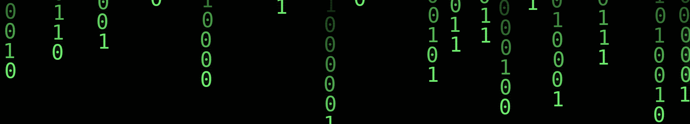

<!-- Binary Rain Banner -->

  

# 👋 Hi, I'm Omar Asim

A CS student and developer who likes turning ideas into things that actually work. I build with code, experiment with AI, design interfaces, and occasionally make hardware do things it probably wasn't supposed to. Outside tech, I've spent 5+ years debating, which has taught me to question ideas, explain them clearly, and defend them when necessary.

I'm currently working on a few projects, mainly:

- **JARVIS**, an AI-integrated smart clock using ESP32 & Flutter
- **Synaptara**, an AI research assistant focused on AI/CS research & RAG
- Exploring new projects around **AI agents, LLMs, automation & computer vision**
- Building my portfolio & improving my skills for future software/AI internships

<h3 align="left">Languages and Tools:</h3>

  

  

  

  

  

  

  

  

  

  

  

  

  

  

  

  

<h3 align="left">Contact Me:</h3>

  
  

